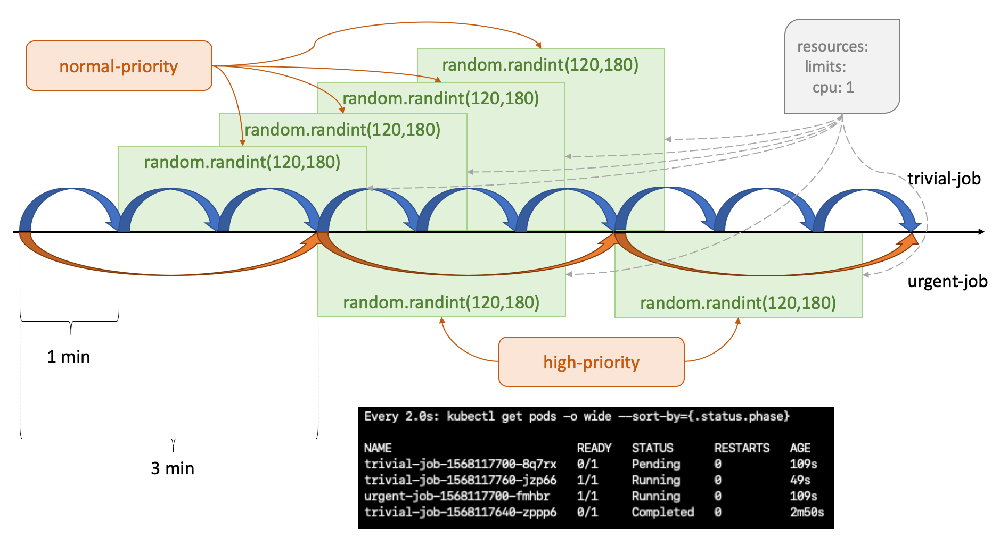

# Kubernetes NonPreemptingPriority gate feature demo

In Kubernetes, _Priority_ determines the importance of a Pod to other
Pods and _Preemption_ is the logic which tries to find a Node to
remove one or more low priority Pods to schedule a high priority Pod.

The goal of this project is to clarify those concepts through code
examples. This project deploys an All-in-One Kubernetes Cluster with
the `NonPreemptingPriority` feature gate enabled with the
[installer](installer.sh) bash script which is consumed by the
[Vagrantfile](Vagrantfile).

## Setup

This project uses [Vagrant tool][2] for provisioning Virtual Machines
automatically. It's highly recommended to use the  *setup.sh* script
of the [bootstrap-vagrant project][3] for installing Vagrant
dependencies and plugins required for its project. The script
supports two Virtualization providers (Libvirt and VirtualBox).

    $ curl -fsSL http://bit.ly/initVagrant | PROVIDER=libvirt bash

Once Vagrant is installed, it's possible to deploy the demo with the
following instruction:

    $ vagrant up

## Demo

After the All-in-One Kubernetes Cluster is deployed the
[installer](installer.sh) creates two kubernetes cron jobs with
different `PriorityClass` on their pods. The `trivial-job`
executes a counter job every minute and the `urgent-job` every three
minutes. They are using `preemptionPolicy: Never` to avoid any
preemption process.

As you can see, the jobs of the `urgent-job` have preference in the 
queue during the execution of the jobs without any preempt action over
the existing Pods of `trivial-job`.

## License

Apache-2.0

[1]: https://github.com/kubernetes-sigs/kubespray
[2]: https://www.vagrantup.com/
[3]: https://github.com/electrocucaracha/bootstrap-vagrant
